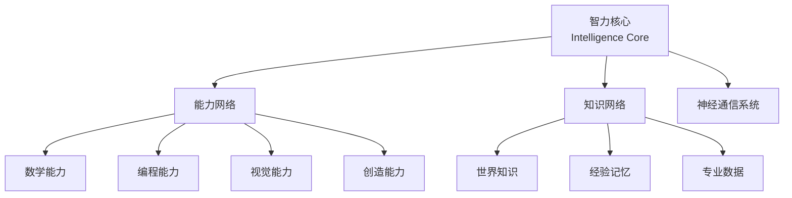

# AGI思考

> **一句话总结：** 未来 AGI 不应该是一个无限膨胀的神经网络，而应该是一个拥有稳定智力核心、可插拔能力模块、动态知识网络，并通过统一神经通信协议不断成长的人工智能生态系统。
>
> 更简洁地说：**AGI 不是一个模型，而是一种可以生长的智能架构。**

---

## 一、核心观点：AGI 不是巨大模型，而是可成长的智能生态

当前主流大模型的工作方式：

```text
大量数据
   ↓
训练
   ↓
一个固定的大模型
   ↓
输出结果
```

特点：知识、推理能力、专业能力全部混合在参数里。

真正的 AGI 不应该把所有东西压缩进一个巨大网络，而应该像人脑一样，把不同功能分层组织：



---

## 二、AGI 的三个核心组成

### 1. 智力网络（Intelligence Network）

最核心的部分，负责：

- 推理
- 抽象
- 学习
- 规划
- 自我调整

类似人类的前额叶和高级认知能力。

特点：

- 应该尽量保持稳定
- 它不是知识库
- 它是**学习和思考的方法**

### 2. 能力网络（Skill Network）

对应不同领域的专家，例如数学专家、代码专家、视觉专家、医学专家、机器人专家。

类似人脑学习：

- 学习钢琴 → 增加音乐能力
- 学习编程 → 增加程序能力

核心设想：

> 能不能像安装插件一样增加能力？例如 AGI 核心 + Physics Expert → 获得物理能力，而不是重新训练整个模型。

### 3. 知识网络（Knowledge Network）

负责事实、经验、数据和记忆，类似人的海马体和长期记忆。

未来可能的形式：

```text
世界知识库
  +
个人记忆
  +
经验数据库
```

---

## 三、MoE 可能是未来 AGI 的雏形

当前 MoE 的形态：

```text
       Router
          |
-------------------
Expert1 Expert2 Expert3
```

存在的问题：

- 专家数量固定
- 训练完成后无法成长

未来 MoE 的设想：

```text
       智能路由器
          |
----------------------------
数学专家 代码专家 医学专家 新增加专家...
```

能力：

- 动态增加专家
- 热插拔能力
- 持续学习

类似人学习新技能。

---

## 四、AI 之间应该有"神经通信"，而不是文字通信

现在的 AI 通信：

```text
模型A → 文字 → 模型B
```

效率低，因为文字只是人类设计的信息压缩方式。

未来应该：

```text
模型A
   ↓
hidden state / latent representation
   ↓
模型B
```

直接传递概念、思维状态和知识结构。

类比：人脑内部的视觉区域不会先翻译成语言，再交给语言区域。

---

## 五、AI 需要"书同文、车同轨"

### 书同文：统一语义空间

现在不同模型各有各的表示空间：

- GPT 空间
- Llama 空间
- 视觉模型空间

彼此无法理解。

未来应该建立 **Universal Semantic Space（统一概念坐标）**，让"苹果"在不同 AI 内部表示接近。

### 车同轨：统一通信协议

类似计算机世界的 USB、TCP/IP、PCI-E。

未来 AI 需要 **Neural Communication Protocol（神经通信协议）**，让一个模型的输出可以被另一个模型直接理解。

---

## 六、固定 Embedding 是不是解决方案？

思路：提前训练一个统一 embedding，例如"苹果" → 固定向量，所有模型冻结 embedding。

优点：解决输入空间统一的问题。

不足：

> 词向量 ≠ 思维。

真正需要统一的是 **Concept Space / Semantic Representation Space（概念空间）**。

同一个"苹果"：

- 厨师看到：食材、味道、烹饪
- 生物学家看到：植物、果实、种子

需要统一的是概念网络，而不只是词向量。

---

## 七、AI 未来可能需要"神经接口标准"

计算机的生态：

```text
硬件 → 标准接口 → 生态
```

未来 AI 的生态：

```text
智能模块 → 神经接口 → 智能生态
```

可能包括：

- 统一语义空间
- 神经通信协议
- 能力模块接口
- 知识交换协议

---

## 八、现在 AI 是不是永远无法达到 AGI？

不是。

现在的大模型可能相当于 **AGI 的大脑皮层**，但缺少：

- 记忆系统
- 能力模块
- 持续学习
- 神经连接机制

未来可能的组合：

```text
Transformer
  +
Memory
  +
MoE
  +
Agent
  +
Neural Communication
  +
Modular Learning
```

形成完整的 AGI。

---

## 九、AGI 是否一定需要昂贵设备？

不是。现在 AI 贵，是因为：

```text
暴力训练
  +
巨大参数
  +
低效率硬件
```

而不是智能本身必须昂贵。

人脑约 20 瓦功耗，说明智能可以非常高效。

未来可能的发展路径：

```text
超级服务器 AGI → 企业 AGI → 个人 AGI → 端侧 AGI
```

---

## 十、浓缩成一句话

> **未来 AGI 不应该是一个无限膨胀的神经网络，而应该是一个拥有稳定智力核心、可插拔能力模块、动态知识网络，并通过统一神经通信协议不断成长的人工智能生态系统。**

---

## 研究方向：Modular AGI Architecture（模块化通用人工智能架构）

包含：

- Universal Representation Space（统一表示空间）
- Neural Communication Protocol（神经通信协议）
- Expandable MoE（可扩展专家网络）
- Lifelong Learning（终身学习）
- Externalized Knowledge Memory（外部知识记忆）

核心问题：

> **如何让人工智能从"一个训练好的模型"，进化成"一个会成长的智能生命系统"。**
